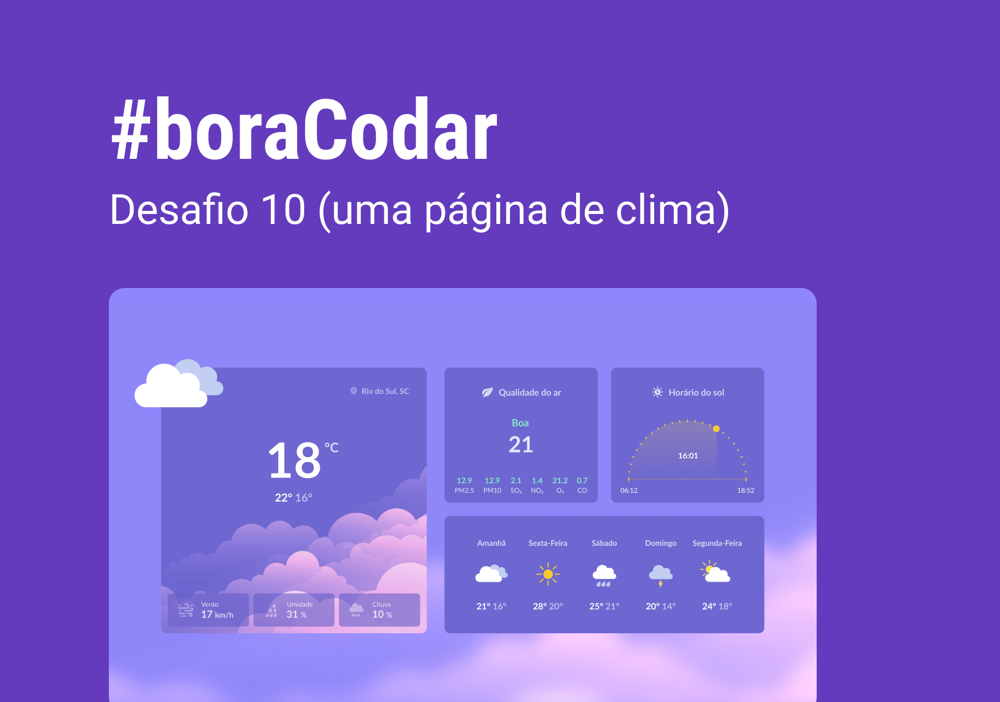

<h1 align="center"> Uma Página de Clima </h1>

Desafio 10 do #boraCodar, promovido pela Rocketseat para ensino de tecnologias WEB.

  <a href="#-tecnologias">Tecnologias</a>&nbsp;&nbsp;&nbsp;|&nbsp;&nbsp;&nbsp;
  <a href="#-projeto">Projeto</a>&nbsp;&nbsp;&nbsp;|&nbsp;&nbsp;&nbsp;
  <a href="#-layout">Layout</a>&nbsp;&nbsp;&nbsp;|&nbsp;&nbsp;&nbsp;
  <a href="#memo-licença">Licença</a>

  

 

  

## 🚀 Tecnologias

Esse projeto foi desenvolvido com as seguintes tecnologias:

- HTML e CSS
- Git e Github
- Figma

## 💻 Projeto

Uma página de clima

## 🔖 Layout

Você pode visualizar o layout do projeto através [DESSE LINK](https://www.figma.com/file/T874iepDUz3A0mPfqnqzta/%23boraCodar---Desafio-10-(Community)?node-id=0-1&t=k01yfBYPOOeu2VUI-0). É necessário ter conta no [Figma](https://figma.com) para acessá-lo.

## 🎖️ Licença

Esse projeto está sob a licença MIT.